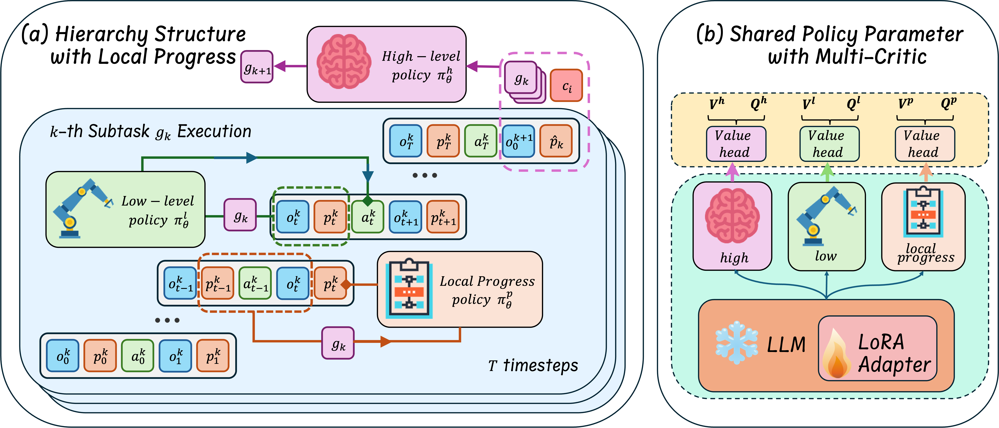

<div style="display: flex; align-items: center; gap: 2px;">
  <h1 style="margin: 0; font-size: 14px;">Hierarchical Reinforcement Learning with Augmented Step-Level Transitions for LLM Agents</h1>
</div>

<!-- <p align="center">
  <a href="https://arxiv.org/abs/2505.19761"></a>
  <a href="https://github.com/NJU-RL/GLIDER/stargazers"></a>
</p> -->

Shuai Zhen<sup>1</sup>, Yanhua Yu<sup>1<sup>[✉]()</sup></sup>, Ruopei Guo<sup>2</sup>, Nan Cheng<sup>2</sup>, Yang Deng<sup>3</sup>, 

<sup>1</sup>Beijing University of Posts and Telecommunications  <sup>2</sup>China Mobile Group Design Institute <sup>3</sup>Singapore Management University


## Overview



**(a) The pipeline of STEP-HRL**: Local progress policy is responsible for producing a compact summary of local interaction history within each subtask. 
Specifically, the local progress policy $\pi^p_\theta$ depends on previous progress $p^k_{t-1}$, current subtask $g_k$, executed action $a^k_{t-1}$ and the resulting observation $o^k_t$ to the generate updated local progress $p^k_t$.
The low-level policy $\pi^l_\theta$ combines $p^k_t$ with observation $o^k_t$ and subtask $g_k$ to generate primitive actions. 
When current subtask $g_k$ terminates, its final local progress $\hat{p}_k$ is forwarded to the high-level policy $\pi^h_\theta$. Conditioned on the task instruction $c_i$, completed subtasks $G_k$, final local progress $\hat{p}_k$ and the initial observation $o^{k+1}_0$ of next subtask, $\pi^h_\theta$ generates the subsequent subtask. \
**(b) The structure of our model**: Three different policies share the same parameters, but equipped with different critic network respectively for offline RL training.
  

## Prerequisites ⚙️

### Virtual Environment
```shell
conda create -n step-hrl python=3.10 -y
conda activate step-hrl
pip install -r requirements.txt
```

### Benchmark Setup
STEP-HRL is evaluated on two benchmarks: [**ScienceWorld**](https://github.com/allenai/ScienceWorld) and [**AlfWorld**](https://github.com/alfworld/alfworld). Please follow the official installation instructions for each environment.


## Experiments  🔬

### Dataset Preperation
The processed dataset can be downloaded from [**Google Drive**](https://drive.google.com/drive/folders/1vVRqWpG5Us4mzWY41Rk8YUerbgLF236P?usp=drive_link), then place it in the root directory, e.g. `./dataset/alfworld` and `./dataset/scienceworld`. Then run following command to get training data.
```
python env/scienceworld/convert_data_memory.py --half -1
python env/alfworld/convert_data_memory.py --half -1
```

### Behavioral Cloning

Run BC training with the following script with corresponding config in ```./config/step_bc.yaml```:

```shell
deepspeed --num_gpus 8 train_bc.py
```

### Reinforcement Learning
> *For AlfWorld, the improvement is very limited since the tasks are relatively simple. Behavior cloning (BC) alone can already achieve scores around 97.

Run BC training with the following script with corresponding config in ```./config/step_collection.yaml```:
```shell
deepspeed --num_gpus 8 step_data_collection.py
```
Then find corresponding file in `dataset/scienceworld/collect_data` and perform:
```
python env/scienceworld/convert_data_memory.py --half -1 -f <file_path>
```

Then run ORL training with the following script with corresponding config in ```./config/step_rl.yaml```:

```shell
deepspeed --num_gpus 8 train_rl.py
```

### Evaluation 

Set evaluation setting in ```./config/eval_step.yaml``` , then run:

```shell
deepspeed --num_gpus 8 eval_step.py
```


<!-- ## Citation 📚

If you find our paper useful, please consider to star this repository and cite it:
```tex
@inproceedings{hu2024divide,
      title={Divide and Conquer: Grounding LLMs as Efficient Decision-Making Agents via Offline Hierarchical Reinforcement Learning},     
      author={Zican Hu and Wei Liu and  Xiaoye Qu and Xiangyu Yue and  Chuniln Chen and Zhi Wang and Yu Cheng},
      year={2025},
      booktitle={Proceedings of the 42st International Conference on Machine Learning}
}
``` -->

## Acknowledgements 
This repository builds upon the implementation of [GLIDER](https://github.com/NJU-RL/GLIDER).
We thank the authors for their excellent work and releasing their code.